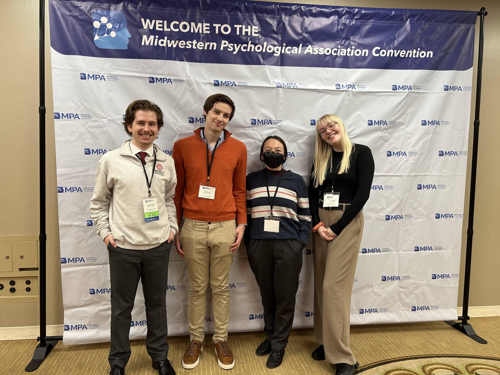

I am currently accepting graduate students into my lab. 

**Thesis Advisor**

Will Ervin, Cognitive and Experimental Psychology, Illinois State University

_M.S. Thesis Title:_ Epistemics, gradable adjectives, and authority

**Thesis Committee Member**

Arghya Kashyap, Cognitive and Experimental Psychology, Illinois State University

_M.S. Thesis Title:_ Exploratory probing and affordances

[Travis Hicks](https://www.linkedin.com/in/travis-hicks-692519123/), Developmental Psychology, Illinois State University

_M.S. Thesis Title:_ Children's understanding of the internet as a moderator for age-related trust tendencies

**Undergraduate research assistants**

_Current_
Ari O'Connell
Madi Sapp
Aidan Marcikic
Evan Jensen
Kelly Fletcher
Alexandria Hernandez
Charlisa Mao

_Alumn_
Sydney Miller
Oliver King

